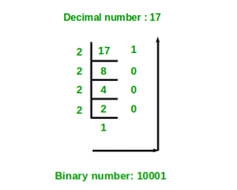
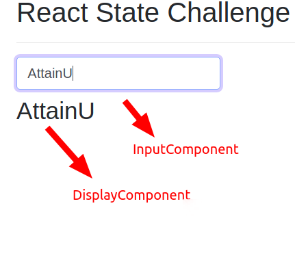
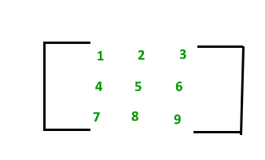

# Challenge 1 - Looping through an array
Consider the following array: 
```js
var players = [
{ name: "Roger Federer", rank: 1 },
{ name: "Rafel Nadal", rank: 2 },
{ name: "Nalbandian", rank: 12 },
{ name: "Andy Murray", rank: 14 },
{ name: "Andy Roddick", rank: 4 },
{ name: "Pete Sampras", rank: 3 },
{ name: "Rod Laver", rank: 190 },
{ name: "Andre Agassi", rank: 11 },
{ name: "Novak Djokovic", rank: 5 },
{ name: "Arthur Ashe", rank: 8 },
];
```

Write a `for` loop that only prints players with rank less than or equal to 10.

# Challenge 2 - Find initials of a name
Write a JavaScript function which accepts a name and prints the initials.

Input: `Mahendra Singh Dhoni`
Output: `MSD`

Input: `Shah Rukh Khan`
Output: `SRK`

# Challenge 3 - Compare two arrays
Write a JavaScript function that compares two arrays and prints whether they are equal or not.

> **Note:** Two arrays are considered equal if both arrays contain the same number of elements, and all corresponding pairs of elements in the two arrays are equal. In other words, two arrays are equal if they contain the same elements in the same order.

# Challenge 4 - Looping and searching
Create a function which takes a state as input and loops through the data to output the cities that belong to that state. The data can be found in the file [cities.json](data/cities.json)


# Challenge 5 - Star pattern
Write a JavaScript function that produces a star pattern likes this.

```
*
**
***
****
*****
****
***
**
*
```

# Challenge 6 - String Search
First, load the [cities.json](data/cities.json) using Ajax.

Then write a Javascript function that takes a letter and finds all the cities that starts with that letter.

# Challenge 7 - Login page using Bootstrap
Create a login page using bootstrap which looks like the below screenshot 


# Challenge 8 - Book search app (client side)
Create a Javascript application that lets the user search for books under a particular language 


Use AJAX to load [books.json](data/books.json)

Use an event handler to get the user input from the form.

Create DOM manipulation methods to show the search result using a table.

# Challenge 9 - Looping with condition
Write a Javascript program that prints even numbers from 1 to 100 in descending order.
The output should show:
```
100
98
96
.
.
.
2
```

# Challenge 10 - Hamming distance
Write a program to find the Hamming distance between two strings.

> **Note:**  Hamming distance between two strings of equal length is the number of positions at which the corresponding characters are different. In more technical terms, it is a measure of the minimum number of changes required to turn one string into another.

The Hamming distance between:

1. "karolin" and "kathrin" is 3.
2. "karolin" and "kerstin" is 3.
3. 1011101 and 1001001 is 2.
4. 2173896 and 2233796 is 3.

# Challenge 11 - Github users API
Use AJAX to call the Github users API at https://api.github.com/users. Obtain a list of users from the API and show them in Bootstrap cards.

# Challenge 12 - Anagram
Given 2 strings, find whether one is an anagram of the other.

> **Note:** Two strings are anagrams if they are written using the same exact letters. Each letter should have the same count in both strings. e.g. 'binary' and 'brainy'

# Challenge 13 - Palindrome
Write a function to check whether a given string is a palindrome.

> **Note:** A palindrome is a word that is the same when read backwards. e.g. `kayak`, `madam`, `malayalam`

# Challenge 14 - Formatting time
Write a function that takes a number input in seconds and returns the number of hours, minutes and seconds as output. Separate the number of hours, minutes and seconds with colons `:`.

```
Input: 126
Output: "0:2:6"

Input: 45
Output: "0:0:45"

Input: 3700
Output: "1:1:40"
```
# Challenge 15 - Character increment
Write a function to take a string as input and change each letter to the next letter in the alphabet.

```
Input: "hello"
Output: "ifmmp"

Input: "zeta"
Output: "afub"
```

# Challenge 16 - URL parameter extraction
Write a function to take a url as a string input and extract all url parameters from it. Return an object contaning these key-value pairs.

```
Input: "http://localhost:3000/add?num1=5&num2=3"
Output: { "num1": 5, "num2": 3 }

Input: "http://localhost:3000/search"
Output: "Missing URL parameters!"
```

# Challenge 17 - Factorial
Write  a function to take a number input and output its factorial.

> **Note:** The factorial of any number is the product of all positive integers less than or equal to it. Factorial is mathematically denoted by the symbol `!`.

```
4! = 4 * 3 * 2 * 1 = 24

6! = 6 * 5 * 4 * 3 * 2 * 1 = 720
```

# Challenge 18 - Decimal to binary
Write a function to input a decimal (base-10) number and return its binary equivalent (base-2). The image below illustrates the method to get a binary equivalent `10001` of a decimal number `17`.



# Challenge 19 - Fibonacci
Write a function to take an input n and print first n terms of the Fibonacci series.

> **Note:** The Fibonacci Sequence is the series of numbers - 0, 1, 1, 2, 3, 5, 8, 13, 21, 34, ...
> Any term of the Fibonacci series is found by adding up the two numbers before it.

# Challenge 20 - Pangram
Given a string, find all characters that are missing from the string, i.e., the characters that can make the string a pangram. Print the output in alphabetic order, case-insensitive.

> **Note:** A pangram is a sentence containing every letter in the English alphabet.

```
Input : The quick brown fox jumps
Output : adglvyz
```

## Week 12

### Day 3: Numbers to words

Create a Javascript function that takes a number and convert it into words.

For example, if your function is `convert`, the following are some sample call results -`convert(1234)` => `One Two Three Four`
`convert(90)` => `Nine Zero`
`convert(117)` => `One One Seven`

Hints:

Breaking down the problem into smaller pieces, the hardest part is to get individual digits from the number.

That is you need to get 1, 2, 3, and 4 individually from the number `1234`.

Now to do that, you can divide the number by 10 and get the reminder repeatedly till the number is zero. And the reminder in each step will be your individual digit.

When you get the digit, finding the corresponding word is easy. You can simply create an array like `words = ["Zero", "One", "Two" ...]` and map each digit as the index to get the word for it.

## Week 13

### Day 2: Check for power of 2

Create a Javascript function that checks if a number is power of two.

For a number that is power of two, you should return `true`. For others, you should return `false`. Examples: `isPowerOfTwo(16)` => `true`
`isPowerOfTwo(9)` => `false`

**Hint:** You can easily check if a number is power of two by repeatedly dividing it by two and check for any reminders until the number becomes 1 or less.

If there is a remainder, the number is not a  power of two. If we can divide until one without any remainders, the number is a power of two.

### Day 4: Prime Numbers

A prime number is any number that can be divided, without a remainder, only by itself and by 1. For example, 23 can be divided only by 23 and by 1.

It can be also defined as - A prime number is a natural number greater than 1 that cannot be formed by multiplying two smaller natural numbers, according to Wikipedia.

Here are a few links to understand it better if you are very new to primes -https://www.mathsisfun.com/prime_numbers.html
https://www.khanacademy.org/math/pre-algebra/pre-algebra-factors-multiples/pre-algebra-prime-numbers/v/prime-numbersNow you understand what a prime number is, lets create a Javascript program that has the following two functions -

1. A function to check if a number is prime or not.
2. Another function that generates `n` prime numbers. That is if we pass `35` to this function, it should return an array of 35 prime numbers.

Hints:

1. A simple algorithm to check if a number is prime or not is to repeatedly divide the number from 2 to one less than the number. At any point, if there is not a remainder from the division, you can conclude that the number is not prime.

## Week 14

### Day 1: Sum of series

Given the value of n, we need to find the sum of the series where i-th term is sum of first i natural numbers.

1 + (1+2) + (1+2+3) + (1+2+3+4) + …… + (1+2+3+4+…+n)

```
Input: 5
Output: 35
Explanation: (1) + (1+2) + (1+2+3) + (1+2+3+4) + (1+2+3+4+5) = 35

Input: 10
Output: 220
Explanation: (1) + (1+2) + (1+2+3) +  .... +(1+2+3+4+.....+10) = 220
```

### Day 4: React events & states

Create a React app that checks if a number entered is even or not.

The component should have a input element to enter the number and a button for the user to click and check odd/even status of the number.

### Day 5: Setup React development environment and create a simple HelloWorld button component

Create a react app using `npx create-react-app first-app`. Create a `HelloWorld` component which renders a simple button on the page.

## Week 15

### Day 2: React state lifting


Create a React app whoose UI looks like the above picture.

There should be three components in the app:

1. `InputComponent` - that receives the text input from the user.
2. `DisplayComponent` - that shows whatever text is typed by the user in `InputComponent`
3. `App` - the root component which holds both `InputComponent` and `DisplayComponent`

Whatever text is typed inside the input box should be shown in the display component (which can be an h2 tag).

**Hints:**

1. This app should use the `Lifting the state up to the parent component` concept we have learnt. That is, input text should be stored in the state of the `App` component so that the `DisplayComponent` can accept it.
2. The `App` component should pass down required properties and methods as props to both `InputComponent` and `DisplayComponent`.
3. Start building the UI first, then try to store the state of changed input text in `InputComponent` itself. Then try to move the state up to the `AppComponent`.

### Day 4: Meal search app


1. Create a simple React JS application that illustrates how to perform a search.
2. In this application, query one of the [themealdb.com](themealdb.com) APIs that returns an array of meals to be displayed.
3. Use the animated gif for reference.
4. API guide and examples [here](https://www.themealdb.com/api.php)

**Hints:** Single component will do the trick. Have the API call fire on click of the 'Search' button. No lifecycle methods needed here.

### Day 5: 2D Array


We know that an array is a row of elements. Similarly, we can also implement a 2D array (also called a matrix). This is a table of elements containing rows and columns.

We access an element as `a[i][j]`, where `i` is the row index and `j` is the column index.

To define a 3x3 matrix as shown in the image,
```
var a = [[1,2,3],[4,5,6],[7,8,9]]

console.log(a[0][0]); // 1
console.log(a[0][1]); // 2
console.log(a[1][0]); // 4
console.log(a[2][1]); // 8
console.log(a[1]); // [4, 5, 6]
```

Given a matrix, find the maximum element of each row.
```
Input: [[1, 2, 3],
        [1, 4, 9],
        [76, 34, 21]]

Output: 3, 9, 76


Input: [[1, 2, 3, 21],
        [12, 1, 65, 9],
        [1, 56, 34, 2]]

Output: 21, 65, 56
```
You can hardcode the input matrix and call the function multiple times for these inputs.

## Week 16

### Day 2: Addition of matrices

Write a program which adds two matrices of same size. Before proceeding, check if they are of the same size.
```
Input:
var a = [[1, 1, 1, 1],  
        [2, 2, 2, 2],  
        [3, 3, 3, 3],  
        [4, 4, 4, 4]];  

var b = [[1, 1, 1, 1],  
        [2, 2, 2, 2],  
        [3, 3, 3, 3],  
        [4, 4, 4, 4]]; 

Output:
[[2, 2, 2, 2],  
[4, 4, 4, 4],  
[6, 6, 6, 6],  
[8, 8, 8, 8]]; 

```

### Day 3: Atoms count

Given a chemical formula as a string, the task is to get the count of atoms in the chemical formula.
```
Input: str = "Fe2H3OH"
Output: Fe 2
        H 4
        O 1

Input: str = "NaCl2NaO2"
Output: Na 2
        Cl 2
        O 2
```

### Day 5: 

Given a number N, the task is to print the following pattern:
```
Input: 10
Output:                    
          * 
         * * 
        * * * 
       * * * * 
      * * * * * 
     * * * * * * 
    * * * * * * * 
   * * * * * * * * 
  * * * * * * * * * 
 * * * * * * * * * * 

Input: 5
Output:
     * 
    * * 
   * * * 
  * * * * 
 * * * * * 
```

## Week 17

### Day 1

Create two Javascript functions - `largest` and `smallest`.

Both of them takes an array of numbers as an input.

`largest` should return the largest number in the array.
`smallest` should return the smallest number in the array.

Feel free to use any technique - either algo based or any of the JS' builtin feature to solve this problem.

### Day 2 

Create a JavaScript function that reads a file and searches for a string in it.

For example, if called like this - `searchFile("file.txt", "AttainU")`, it should return the line numbers and text in the line that contains the string "AttainU".

### Day 3

Write a Javascript program that prints the numbers from 1 to 100 with the following rules
1. For numbers that are multiples of three, print `Fizz` instead of the number.
2. For numbers that are multiples of five print `Buzz`.
3. For numbers which are multiples of both three and five print `FizzBuzz`.

### Day 4

Create a Stack class using arrays and ES6 class.

Stack is an ordered data structure that supports two functions - `push` and `pop`. `push` adds an element to a stack, where `pop` removes it.

The adding and removal of elements take a special order. The last element added to a stack will be the first element to be removed from it, when called using push and pop respectively.

**Hint:** You can use an array to represent the stack in your class. Then use the array push/pop or shift/unshift methods to get the element in or out of the array.

### Day 5

Consider two sorted arrays, A and B.

Write a Javascript function that merges these two arrays maintaining the sorted order.

We know that this can be easily achieved using `.concat()` and then `.sort()` methods. However, for this problem, you cannot use the `.sort()` function. Try to do the merge without it.

## Week 18

### Day 3

Write a Javascript function that takes a string and compresses it.

You can use a simple character count algorithm for the compression. So for each character in the input string, replace it with a number if the next character(s) are the same.

So an input string like `AAABCCDDDD` will become `A3BC2D4`.

### Day 5

The sum of the squares of the first ten natural numbers is,
1 ^ 2 + 2 ^ 2 + ... + 10 ^ 2 = 385

The square of the sum of the first ten natural numbers is,
(1 + 2 + ... + 10) ^ 2 = 552 = 3025

Hence the difference between the sum of the squares of the first ten natural numbers and the square of the sum is 3025 − 385 = 2640.

Find the difference between the sum of the squares of the first one hundred natural numbers and the square of the sum.

## Week 19

### Day 1

2 ^ 15 = 32768 and the sum of its digits is 3 + 2 + 7 + 6 + 8 = 26.

What is the sum of the digits of the number 2 ^ 1000?

(Read 2 ^ 15 as 2 raise to 15 or simply exponentiation with the base 2).

**Hint:** Math object has a function to find the power. Once you get that, get individual numbers from the result and add them together.